# Guía de figuras y guion de sustentación

**Integrantes:** Ricardo Amiel Acuña Villogas, Juan Leibniz Aquino Espinoza y Camilo Ernesto Soto Cristóbal.

Este documento recorre las treinta y ocho figuras del proyecto. De cada una dice tres cosas distintas: qué muestra el dato, cómo explicarla en voz alta y qué responder a la pregunta que el público va a hacer. El objetivo es que cualquiera del equipo pueda sustentar cualquier figura sin releer el notebook.

La lectura de cada figura es la que generan los notebooks al guardarla, así que coincide palabra por palabra con lo que aparece en el entregable ejecutado y en el reporte interactivo. El razonamiento completo de cada decisión está en [JUSTIFICACION.md](JUSTIFICACION.md); el resultado interactivo está en el [reporte publicado](https://ricardoamiel.github.io/Open-recruitment-in-Peru---DataMining/).

## Si solo hay diez minutos

Diez figuras bastan para contar el proyecto completo, una por idea.

1. **El embudo de limpieza con su costo en filas**, en figs/f02_embudo.png. Sirve para decir que el dato crudo no es el dato analítico y cada descarte está justificado.
2. **Curva de Lorenz y coeficiente de Gini de proveedores**, en figs/f11_lorenz.png. Sirve para decir que la concentración del gasto tiene una respuesta cuantitativa y comparable.
3. **Número de postores por tramo de monto**, en figs/f13_competencia.png. Sirve para decir que la falta de competencia tiene dos formas distintas, no una.
4. **El mismo agregado por RDD y por DataFrame**, en figs/f14_rdd_vs_dataframe.png. Sirve para decir que Spark aporta donde hay volumen y que el DataFrame gana al RDD por una razón concreta.
5. **Recall contra costo de verificación en el barrido de LSH**, en figs/f20_recall_vs_costo.png. Sirve para decir que LSH es un generador de candidatos y se evalúa como tal.
6. **Lo aproximado contra lo exacto, en lote y consulta a consulta**, en figs/f24_ann_vs_exacta.png. Sirve para decir que una medición mal planteada da la conclusión contraria.
7. **Bloom contra Count-Min a igual tasa de error**, en figs/f31_bloom_vs_cms.png. Sirve para decir que hacen falta dos estructuras y no una, y el factor está medido.
8. **La canasta natural contra la canasta por entidad y mes**, en figs/f34_definicion_transaccion.png. Sirve para decir que la definición de transacción decide la parte entera.
9. **A-Priori contra FP-Growth al bajar el soporte**, en figs/f35_apriori_vs_fpgrowth.png. Sirve para decir que FP-Growth desplazó a A-Priori por una razón que aquí está medida.
10. **Dónde se concentran los procesos sin competencia**, en figs/f37_postor_unico.png. Sirve para decir que hay un hallazgo y, sobre todo, que sabemos lo que no autoriza a concluir.

El resto de figuras sostienen estas diez. Conviene tenerlas a mano para responder, no para exponerlas en orden.

## Parte I. KDD, EDA y procesamiento distribuido

El hilo de esta parte es que el dato crudo no es el dato analítico. Primero se demuestra que el archivo no dice lo que parece decir, luego se limpia dejando constancia de cada descarte, y solo entonces se responde a las preguntas de interés.

Notebook: [notebooks/1_kdd_eda.ipynb](../notebooks/1_kdd_eda.ipynb)

### Figura 1. Los paquetes anuales rellenan años anteriores

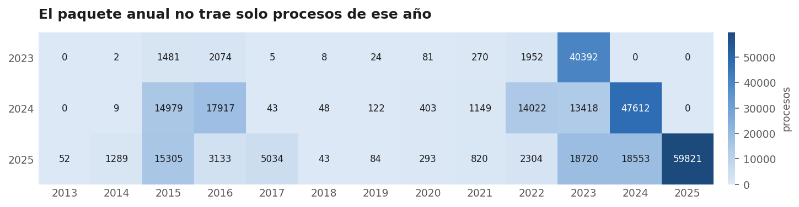

Archivo: figs/f01_paquete_vs_anio.svg y figs/f01_paquete_vs_anio.png

**Qué muestra.** Si cada paquete trajera solo sus propios procesos, toda la masa estaría en la diagonal. No es así: 82,946 filas corresponden a convocatorias anteriores a 2023 que recién entonces se publicaron o corrigieron, y en el paquete 2024 casi la mitad son de 2015 y 2016. Dejarlas haría que la serie temporal muestre actividad de contratación donde en realidad hubo saneamiento de registros nueve años después. Esto justifica recortar la ventana.

**Cómo explicarla.** Empiezo por esta figura porque justifica el recorte que viene después y porque es contraintuitiva. Si el paquete de un año solo trajera convocatorias de ese año, todo estaría en la diagonal. No lo está, y eso significa que la fuente publica correcciones retroactivas: casi la mitad del paquete 2024 son procesos de 2015 y 2016.

**Si preguntan.** ¿Por qué no aprovechar esas filas antiguas en lugar de descartarlas?

**Qué responder.** Porque la serie temporal mediría dos cosas distintas sumadas: contratación real y saneamiento de registros nueve años después. La cobertura de esos años es parcial, así que tampoco servirían para ampliar la ventana. Se recorta a 2023 a 2025, que es el tramo con cobertura homogénea.

### Figura 2. El embudo de limpieza con su costo en filas

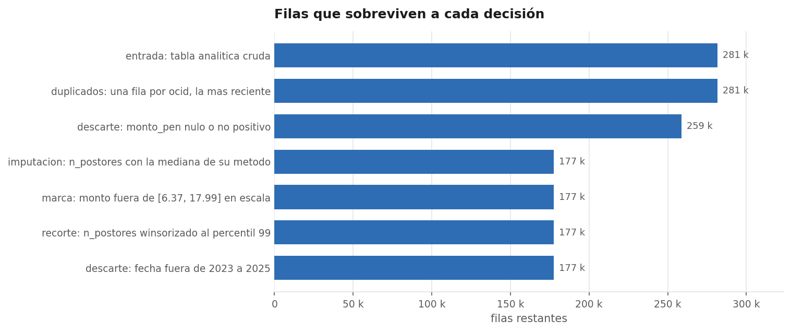

Archivo: figs/f02_embudo.svg y figs/f02_embudo.png

**Qué muestra.** Se pierden 104,064 filas en total, y casi todas en dos pasos: los montos no positivos y la ventana temporal. Los demás pasos imputan, marcan o recortan sin perder ninguna fila, que es lo que se busca: eliminar es la última opción, no la primera.

**Cómo explicarla.** Esta figura es la bitácora hecha gráfico. Cada barra es un paso del proceso de limpieza y la caída muestra cuánto cuesta. La política fue no eliminar salvo que la fila no pueda responder ninguna pregunta: por eso la mayoría de pasos imputa o marca sin perder nada.

**Si preguntan.** ¿Eliminar el 37 por ciento de las filas no es demasiado?

**Qué responder.** Está concentrado en dos decisiones defendibles. El monto igual a cero no es un monto bajo, es un campo no publicado, y promediarlo hundiría toda estimación de gasto. El recorte de ventana es el de la figura anterior. Los otros nueve pasos juntos no pierden ninguna fila.

### Figura 3. Procesos por mes y el límite de cobertura de 2025

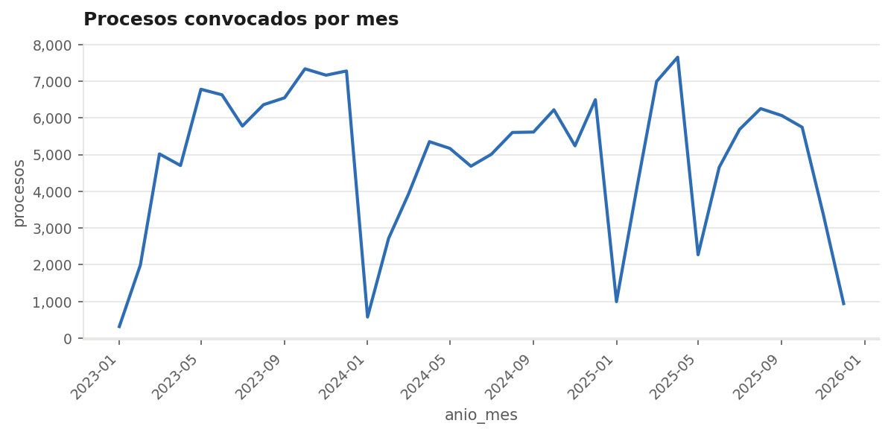

Archivo: figs/f03_procesos_mes.svg y figs/f03_procesos_mes.png

**Qué muestra.** Diciembre es el máximo de su año en los dos años con cobertura completa: 7,280 procesos en 2023 y 6,498 en 2024. La cola de 2025 cae a 3,380 en noviembre y 942 en diciembre, muy por debajo del nivel habitual: eso no es menos contratación sino subcobertura, porque los procesos tardan en entrar al registro OCDS. La Parte IV debe respetar ese límite.

**Cómo explicarla.** Aquí se ve el pico de diciembre que luego se analiza, pero lo que hay que señalar primero es la cola de 2025: cae muy por debajo del nivel habitual. Eso no es menos contratación, es que los procesos tardan en entrar al registro.

**Si preguntan.** ¿Cómo saben que es subcobertura y no una caída real del gasto?

**Qué responder.** Porque el patrón de los dos años completos es el inverso, con máximo en diciembre, y porque la caída empieza justo donde termina la ventana de publicación. Esa es la razón por la que la Parte IV simula el flujo sobre el tramo con cobertura y no sobre los últimos meses.

### Figura 4. Monto por mes, en escala propia

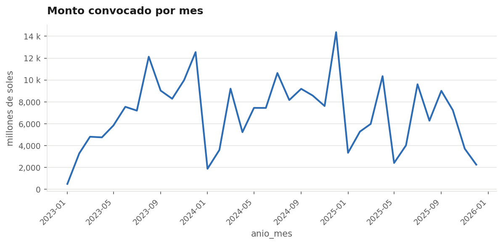

Archivo: figs/f04_monto_mes.svg y figs/f04_monto_mes.png

**Qué muestra.** Se grafica aparte del conteo porque son escalas distintas y un eje doble invitaría a leer una correlación que la figura no sostiene. El máximo de toda la serie es 2024-12 con 14,373 millones de soles, 1.9 veces el mes anterior. El pico de monto es mucho más marcado que el de número de procesos: a fin de año no solo se convoca más, se convoca más caro.

**Cómo explicarla.** La gráfico aparte del conteo a propósito. Con dos ejes en una sola figura el público lee una correlación que el dato no sostiene. Lo que dice es que a fin de año no solo se convoca más, se convoca más caro: diciembre de 2024 es 1,9 veces el mes anterior.

**Si preguntan.** ¿Por qué no usar un eje doble, que ocuparía la mitad del espacio?

**Qué responder.** Porque un eje doble permite elegir escalas que hagan coincidir dos curvas que no tienen por qué coincidir, y eso es sugerir una relación sin medirla. Si hiciera falta afirmar la relación, el camino correcto sería medir el monto mediano por proceso y mes, no superponer curvas.

### Figura 5. Estacionalidad del gasto, mes contra año

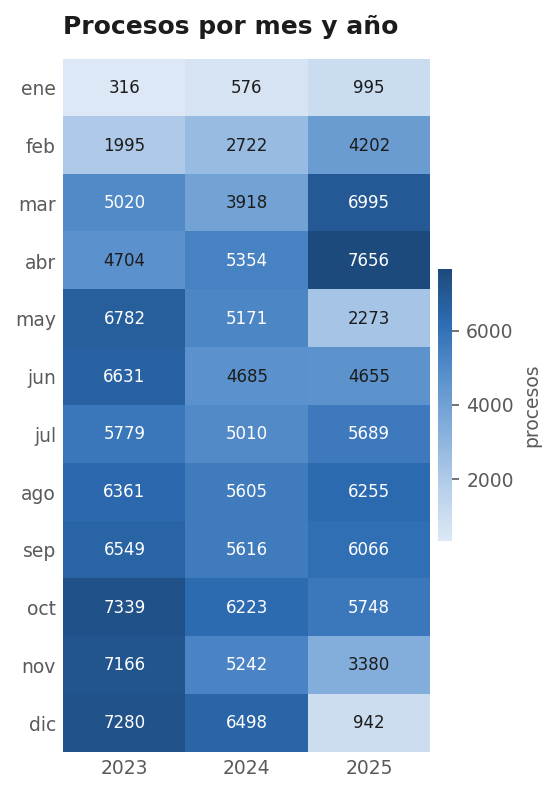

Archivo: figs/f05_estacionalidad.svg y figs/f05_estacionalidad.png

**Qué muestra.** Aísla el calendario del ruido de cada año. Las columnas de 2023 y 2024 se oscurecen hacia el último trimestre y alcanzan su máximo en diciembre; la de 2025 se apaga al final por la subcobertura ya señalada. Que el patrón se repita en los dos años completos es lo que permite atribuirlo al cierre del ejercicio presupuestal y no a un año particular.

**Cómo explicarla.** Esta es la figura con la que respondo la pregunta del apresuramiento del gasto. Separa el efecto calendario del efecto año: si el último trimestre se oscurece en 2023 y también en 2024, el patrón es del calendario presupuestal y no de un año particular.

**Si preguntan.** ¿Un solo pico de diciembre no podría ser un año atípico?

**Qué responder.** Por eso la figura es una matriz y no una serie. El patrón se repite en los dos años con cobertura completa, que es la evidencia mínima para atribuirlo al cierre del ejercicio. Con un solo año no lo afirmaría.

### Figura 6. Distribución del monto en escala logarítmica

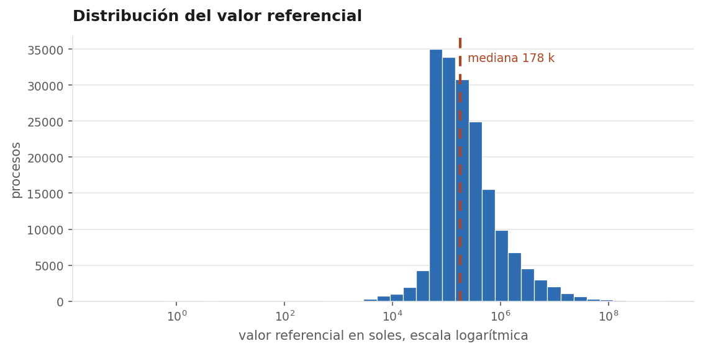

Archivo: figs/f06_distribucion_monto.svg y figs/f06_distribucion_monto.png

**Qué muestra.** La media es 7.9 veces la mediana, así que la media no describe a ningún proceso representativo. En escala lineal esta figura sería una sola barra pegada al eje; el logaritmo es lo que la hace legible y lo que justifica haber aplicado el criterio de extremos sobre esa misma escala. Y el dato que decide: los 565 procesos marcados como extremos son el 0.3 % de las filas y concentran el 38 % del gasto. Eliminarlos habría dejado una tabla más ordenada y habría borrado un tercio del dinero público.

**Cómo explicarla.** La escala logarítmica no es un adorno: en escala lineal esta figura es una sola barra pegada al eje. El dato que decide la política de limpieza está aquí: los procesos marcados como extremos son el 0,3 por ciento de las filas y concentran el 38 por ciento del gasto.

**Si preguntan.** ¿Por qué no eliminaron los valores extremos como se hace habitualmente?

**Qué responder.** Porque en gasto público el extremo es el objeto de estudio, no el ruido. Una licitación de infraestructura es legítimamente mil veces mayor que una compra de útiles. Eliminar el 0,3 por ciento de filas habría borrado un tercio del dinero. Se marcan con una bandera y se reportan aparte.

### Figura 7. Método de contratación, por número y por monto

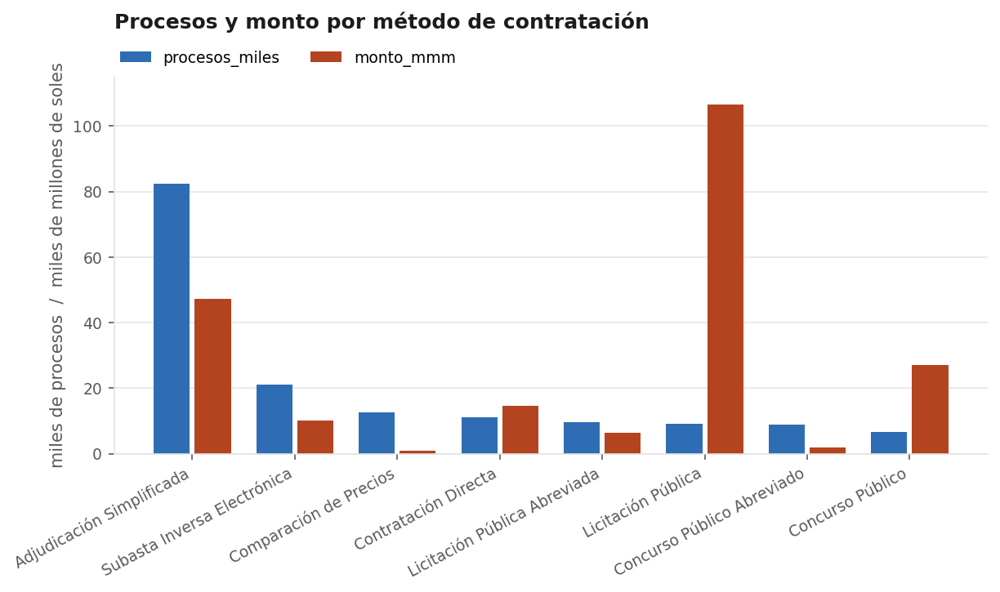

Archivo: figs/f07_metodo.svg y figs/f07_metodo.png

**Qué muestra.** Contar procesos y contar soles dan rankings casi inversos, y ese desacople es el primer hallazgo no obvio. Adjudicación Simplificada encabeza por volumen con 82,503 procesos pero mueve 47.1 mil millones. Licitación Pública, con 9,242 procesos, mueve 106.6 mil millones, el 46 % del total. Cualquier conclusión que mezcle ambas lecturas será falsa.

**Cómo explicarla.** Estos dos rankings son casi inversos y ese desacople es el primer hallazgo no obvio del EDA. Adjudicación Simplificada encabeza por volumen de procesos; Licitación Pública, con nueve veces menos procesos, mueve el 46 por ciento del dinero.

**Si preguntan.** ¿Que consecuencia práctica tiene ese desacople?

**Qué responder.** Que toda afirmación tiene que decir en qué unidad está contando. Una frase como que el método mayoritario es la Adjudicación Simplificada es verdadera en procesos y falsa en soles. La mitad de las lecturas erroneas de datos de contratación vienen de mezclar las dos unidades.

### Figura 8. Nivel de gobierno, una variable derivada

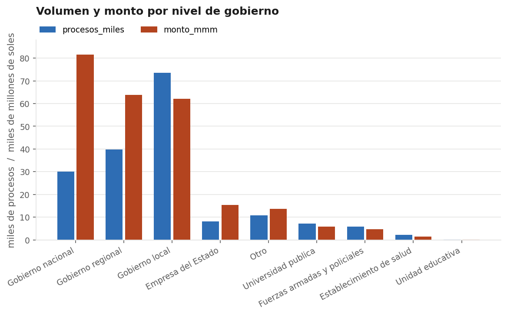

Archivo: figs/f08_nivel_gobierno.svg y figs/f08_nivel_gobierno.png

**Qué muestra.** Los gobiernos locales convocan 73,456 procesos repartidos en 1,855 entidades, muchos más que cualquier otro grupo, y aun así el gobierno nacional los supera en monto con 29,984 procesos y solo 277 entidades. El nivel de gobierno es una variable derivada por expresión regular sobre el nombre de la entidad, no viene en el dato crudo; la categoría Otro recoge lo que ninguna regla reconoce y es el 6.1 % de los procesos, que es la medida honesta de cuánto falla la derivación.

**Cómo explicarla.** El nivel de gobierno no viene en el dato: lo derivamos con expresiones regulares sobre el nombre de la entidad. Los gobiernos locales convocan mucho más y el gobierno nacional gasta más con una decima parte de las entidades.

**Si preguntan.** ¿Que confianza tiene una variable derivada por expresiones regulares?

**Qué responder.** La medimos en lugar de suponerla: la categoría Otro, que es lo que ninguna regla reconoce, es el 6,1 por ciento de los procesos, y esa cifra es la cota de error de la derivación. Se reporta en la figura justamente para que el lector pueda descontarla.

### Figura 9. Las quince entidades que más monto concentran

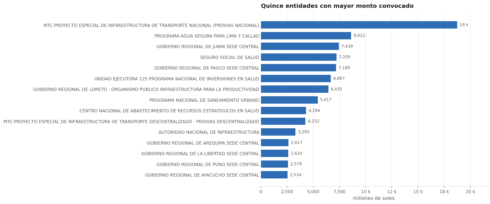

Archivo: figs/f09_top_compradores.svg y figs/f09_top_compradores.png

**Qué muestra.** Se ordena por monto y no por número de procesos porque la pregunta es a dónde va el dinero, no quién hace más trámites. La entidad que encabeza concentra 18,742 millones en 828 procesos. Estas quince entidades suman 89.9 mil millones de soles.

**Cómo explicarla.** Ordeno por monto y no por número de procesos porque la pregunta es a dónde va el dinero. Estas quince entidades suman cerca de noventa mil millones de soles.

**Si preguntan.** ¿No sería más informativo ordenar por número de procesos?

**Qué responder.** Respondería otra pregunta, la de quién tramita más, que es interesante para carga administrativa y no para concentración. Las dos lecturas están en el proyecto y la figura del método muestra por qué no conviene mezclarlas.

### Figura 10. Los quince proveedores que más monto reciben

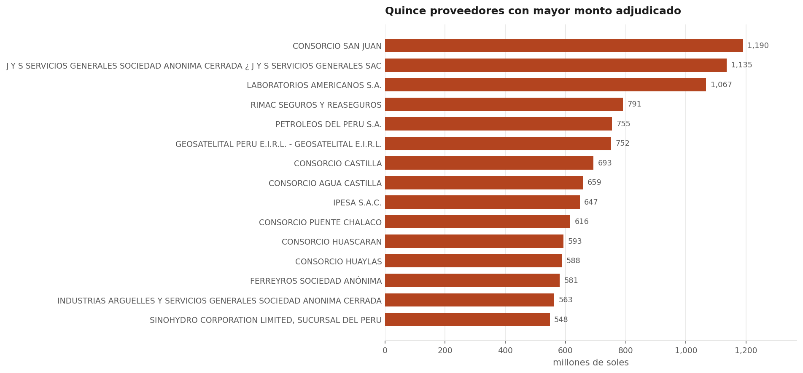

Archivo: figs/f10_top_proveedores.svg y figs/f10_top_proveedores.png

**Qué muestra.** Hay dos formas distintas de llegar arriba y el ranking las pone una al lado de la otra sin distinguirlas. Un proveedor acumula 581 millones repartidos en 188 adjudicaciones; otro alcanza 1,135 millones en apenas 1. Recurrencia y magnitud puntual son fenómenos que no se parecen, y separarlos es tarea de la Parte II.

**Cómo explicarla.** Lo que quiero que se vea aquí es que hay dos formas distintas de llegar arriba y el ranking no las distingue. Un proveedor acumula por recurrencia, con casi doscientas adjudicaciones; otro llega más arriba con una sola.

**Si preguntan.** ¿Eso no es ya un indicio de irregularidad?

**Qué responder.** No, y es importante decirlo. Una sola adjudicación enorme es lo normal en obra publica. Lo que la figura justifica es separar recurrencia de magnitud, y eso es lo que hacen la Parte II con objetos parecidos y la Parte V con patrones de compra.

### Figura 11. Curva de Lorenz y coeficiente de Gini de proveedores

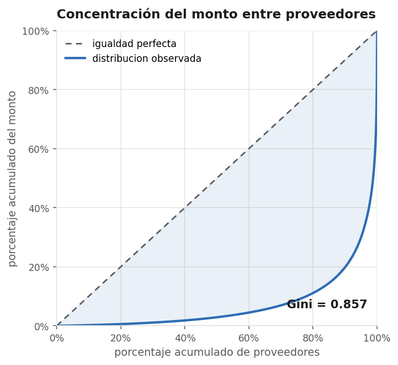

Archivo: figs/f11_lorenz.svg y figs/f11_lorenz.png

**Qué muestra.** Un ranking de quince nombres dice quiénes están arriba pero no cuánto pesan. La curva sí, y lo resume en un número comparable: el Gini es 0.857 sobre 67,510 proveedores. El uno por ciento superior se lleva el 47.1 % del monto y el diez por ciento se lleva el 80.2 %. Esta es la respuesta cuantitativa a la pregunta 1.

**Cómo explicarla.** Esta figura es la respuesta cuantitativa a la primera pregunta de interés. El ranking dice quién está arriba; la curva dice cuánto pesan. El uno por ciento superior de proveedores se lleva el 47 por ciento del monto y el Gini es 0,857 sobre un máximo de uno.

**Si preguntan.** ¿Un Gini de 0,857 es mucho comparado con qué?

**Qué responder.** Con el mismo indicador en otros mercados y con el caso teórico. Cero sería reparto perfecto y uno un solo proveedor. Para referencia, los Gini de ingreso de los países suelen estar entre 0,25 y 0,60, así que 0,857 es concentración alta. Lo que no permite afirmar es que la causa sea anticompetitiva: puede ser economía de escala, especialización técnica o barreras de entrada.

### Figura 12. Gini por departamento contra el nacional

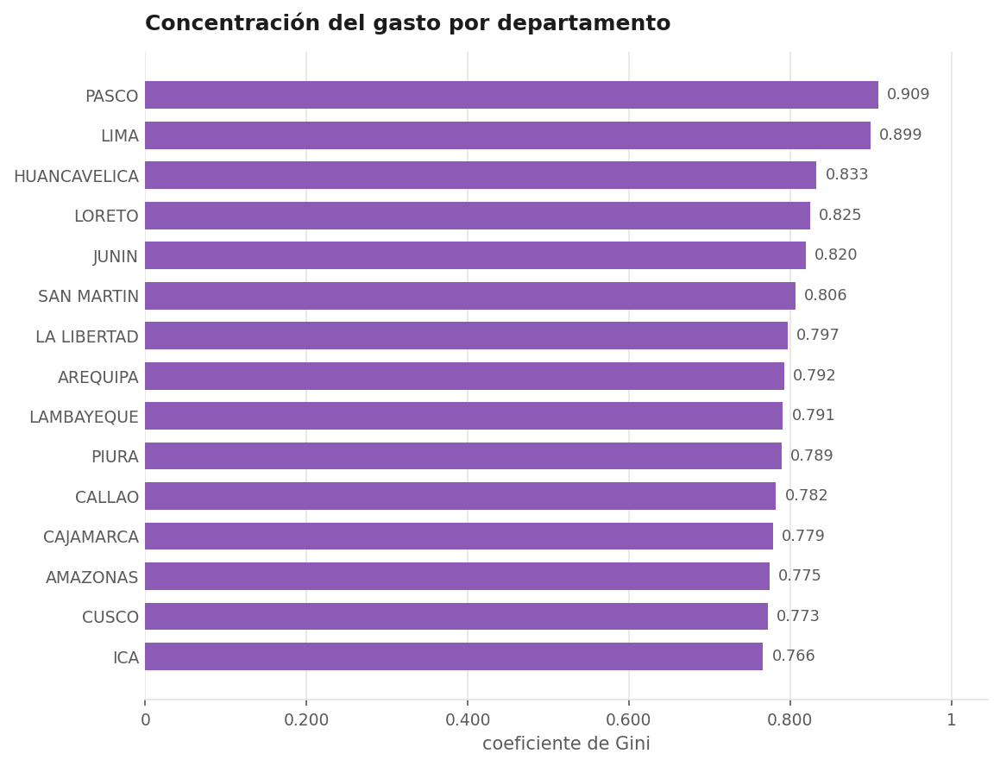

Archivo: figs/f12_gini_departamento.svg y figs/f12_gini_departamento.png

**Qué muestra.** El monto absoluto solo diría que Lima gasta más; el Gini hace comparables mercados de tamaños muy distintos. El resultado va en contra de lo esperado: solo 2 de 25 departamentos superan el Gini nacional de 0.857, y son PASCO, LIMA. El resto queda por debajo. El Gini del país no describe a un mercado regional típico, está empujado hacia arriba por Lima.

**Cómo explicarla.** Esta figura corrige lo que la anterior podría hacer creer. Solo dos de veinticinco departamentos superan el Gini nacional. El resto queda por debajo, así que la cifra del país no describe un mercado regional típico: está empujada hacia arriba por Lima.

**Si preguntan.** ¿Por qué usar Gini por departamento en lugar del monto absoluto?

**Qué responder.** Porque el monto absoluto solo diría que Lima gasta más, que ya se sabe. El Gini es adimensional y hace comparables mercados de tamaños muy distintos, que es exactamente lo que hacía falta para saber si la concentración es nacional o limeña.

### Figura 13. Número de postores por tramo de monto

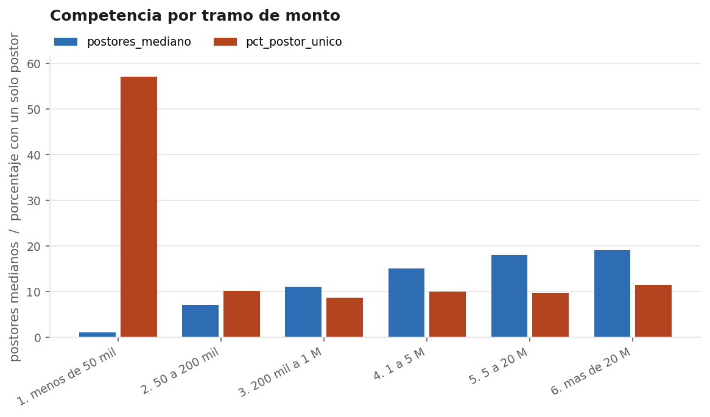

Archivo: figs/f13_competencia.svg y figs/f13_competencia.png

**Qué muestra.** Un diagrama de dispersión con 170,743 puntos sería una mancha; agrupar por tramo muestra la tendencia. El número mediano de postores sí crece con el monto, de 1 a 19. Lo que importa es dónde se rompe: en el tramo más bajo el 57 % de los procesos tuvo un único postor, mientras que en los demás tramos esa proporción se estabiliza cerca del 10 % y ya no baja ni por encima de veinte millones. Son dos fenómenos distintos: una franja pequeña competitiva solo en el papel, y un suelo persistente de uno de cada diez procesos sin competencia. Se excluyen los postores imputados para que la relación no la produzca la propia imputación.

**Cómo explicarla.** Aquí respondo la segunda pregunta de interés, y el hallazgo es que hay dos fenómenos distintos, no uno. Debajo de cincuenta mil soles el 57 por ciento de procesos tuvo un solo postor. En los demás tramos la proporción se estabiliza cerca del 10 por ciento y ya no baja, ni siquiera por encima de veinte millones.

**Si preguntan.** ¿Por qué agrupar por tramos en lugar de graficar los puntos?

**Qué responder.** Porque ciento setenta mil puntos son una mancha negra sin estructura legible. Y hay una precaución más: se excluyen los procesos con número de postores imputado, para que la relación no la produzca la propia imputación.

### Figura 14. El mismo agregado por RDD y por DataFrame

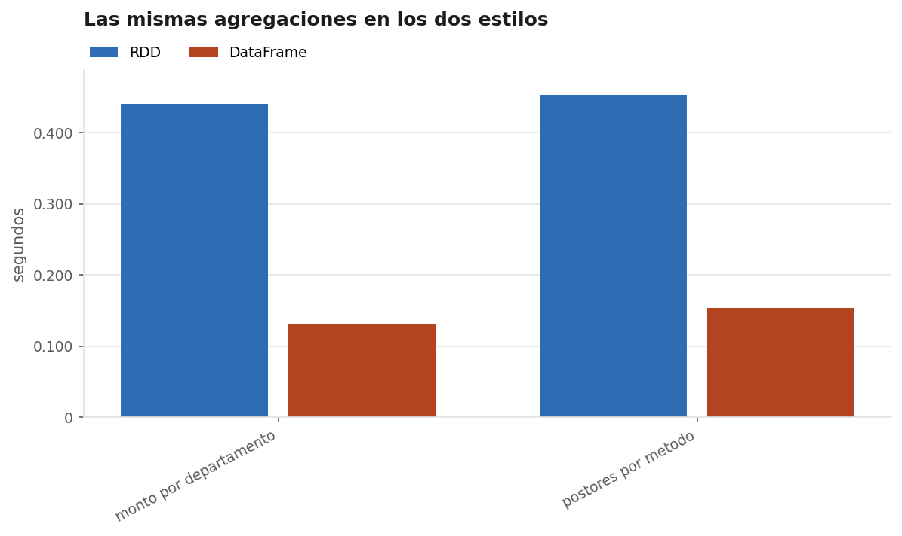

Archivo: figs/f14_rdd_vs_dataframe.svg y figs/f14_rdd_vs_dataframe.png

**Qué muestra.** El camino RDD resulta entre 3.0 y 3.4 veces más lento, y no por gusto: cada fila cruza la frontera entre la máquina virtual de Java y el intérprete de Python, y el planificador no puede podar columnas ni reordenar filtros sobre tuplas opacas. Con 177 mil filas ambos terminan en menos de un segundo, así que aquí la elección se decide por claridad; la brecha crece con el volumen y es ahí donde empieza a costar dinero.

**Cómo explicarla.** Las dos barras calculan exactamente el mismo resultado y lo verificamos con una diferencia de conjuntos en los dos sentidos. El camino RDD es unas tres veces más lento porque cada fila cruza la frontera entre la máquina virtual de Java y el intérprete de Python, y porque el planificador no puede podar columnas ni reordenar filtros sobre tuplas opacas.

**Si preguntan.** ¿Si el DataFrame siempre gana, por qué implementar el RDD?

**Qué responder.** Por dos razones. La primera es que la rúbrica pide demostrar MapReduce, y escribirlo obliga a declarar la clave, el valor y la función de reducción, que es lo que Catalyst esconde. La segunda es que el RDD sigue siendo la herramienta cuando la operación no se expresa en la API de DataFrames.

### Figura 15. Tiempo según el número de particiones de barajado

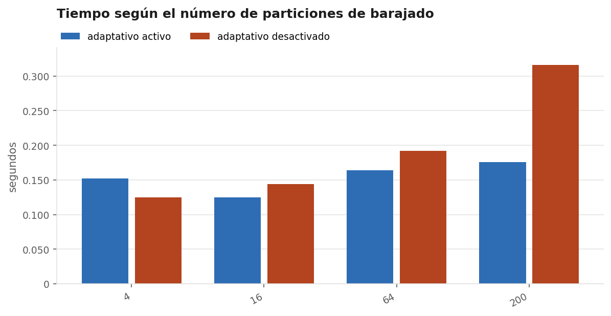

Archivo: figs/f15_shuffle.svg y figs/f15_shuffle.png

**Qué muestra.** Con ejecución adaptativa el parámetro casi no cambia el tiempo: Spark conoce el tamaño real de la salida del barajado y fusiona las particiones pequeñas, así que doscientas declaradas terminan siendo unas pocas efectivas. Al desactivarla aparece el efecto que predice la teoría: 0.32 s con 200 particiones frente a 0.14 s con 16, porque planificar y recoger doscientas tareas de unos cientos de filas cuesta más que el cálculo. La regla de dos a cuatro veces el número de núcleos sigue siendo razonable, y la ejecución adaptativa es lo que evita pagar de inmediato una mala elección.

**Cómo explicarla.** Con ejecución adaptativa activada el parámetro casi no cambia el tiempo, y eso es información: Spark conoce el tamaño real de la salida del barajado y fusiona las particiones pequeñas. Al desactivarla aparece el efecto que predice la teoría, con doscientas particiones el doble de lento que con dieciséis.

**Si preguntan.** ¿Entonces el parámetro ya no importa?

**Qué responder.** Importa menos de lo que decía la teoría clásica, pero importa. La ejecución adaptativa fusiona particiones pequeñas y no puede partir las grandes, así que protege contra declarar demasiadas y no contra declarar muy pocas. La regla de dos a cuatro veces el número de núcleos sigue siendo el punto de partida razonable.

## Parte II. Similitud, shingling, MinHash, LSH y SimHash

El hilo es la reducción de un problema cuadrático a uno lineal sin perder lo que importa. Se mide la similitud exacta para tener patrón de comparación, se aproxima con firmas, y se decide con bandas cuánto error se acepta de cada tipo.

Notebook: [notebooks/2_similitud_lsh.ipynb](../notebooks/2_similitud_lsh.ipynb)

### Figura 16. Calibración del tamaño del shingle

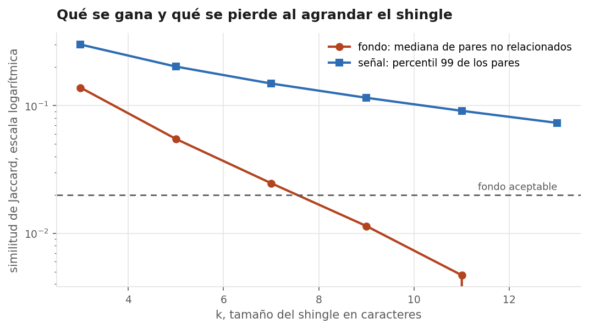

Archivo: figs/f16_calibracion_k.svg y figs/f16_calibracion_k.png

**Qué muestra.** Las dos curvas bajan juntas, así que ninguna métrica sobre pares aleatorios tiene un máximo interior y buscarlo sería fabricar un resultado. Lo que se fija es un criterio: k debe ser lo bastante grande para que dos objetos no relacionados no compartan casi nada. Con k = 3 el fondo está en 0.138, es decir que dos textos cualesquiera ya se parecen un 14 % solo por ser español administrativo. El primer k que deja el fondo por debajo de 0,02 es k = 9, con fondo 0.0114 y señal 0.115. Subir más solo recorta señal y gasta memoria. La elección no es crítica: el barrido de LSH de la sección 4 da resultados muy parecidos con k = 7 y k = 11.

**Cómo explicarla.** Esta figura es la que más me interesa defender porque documenta un resultado negativo. Buscábamos un k óptimo y no existe: las dos curvas bajan juntas, así que ninguna métrica sobre pares aleatorios tiene un máximo interior. Lo que hicimos fue fijar un criterio explicito en lugar de inventar una métrica que diera el k que queríamos.

**Si preguntan.** ¿Cuál es el criterio y qué pasa si se elige otro k?

**Qué responder.** El criterio es que dos objetos no relacionados compartan casi nada, en concreto que el fondo quede por debajo de 0,02, y el primer k que lo cumple es nueve. Con k igual a tres el fondo está en 0,138, es decir que dos textos cualesquiera ya se parecen un 14 por ciento solo por ser español administrativo. Y la elección no es crítica: el barrido de LSH da resultados muy parecidos con siete y con once.

### Figura 17. Distribución de la similitud de Jaccard exacta

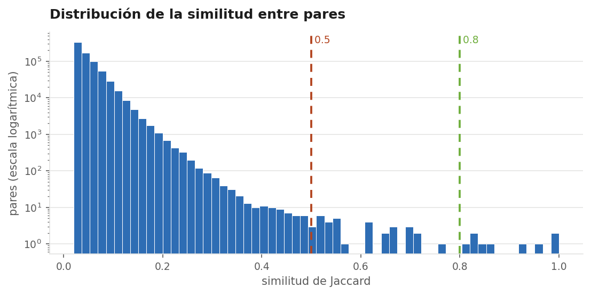

Archivo: figs/f17_distribucion_jaccard.svg y figs/f17_distribucion_jaccard.png

**Qué muestra.** El eje vertical va en logaritmo porque si no, la primera barra aplasta todo lo demás. La enorme mayoría de los pares tiene similitud casi nula, que es lo esperable y justamente lo que hace viable LSH: solo 42 pares de 1,999,000 superan 0,5, es decir el 0.002 %. Comparar todos los pares para encontrar esa fracción es desperdicio, y ese desperdicio es lo que LSH elimina.

**Cómo explicarla.** Esta es la figura que justifica que LSH exista. De dos millones de pares, solo cuarenta y dos superan 0,5 de similitud, el 0,002 por ciento. Comparar todos los pares para encontrar esa fracción es desperdicio, y ese desperdicio es lo que LSH elimina.

**Si preguntan.** ¿Por qué el eje vertical está en logaritmo?

**Qué responder.** Porque la primera barra es tres órdenes de magnitud mayor que las demás y en escala lineal aplasta todo el resto contra el eje. La figura perdería justamente la cola, que es la única parte interesante.

### Figura 18. Error de MinHash según el número de funciones hash

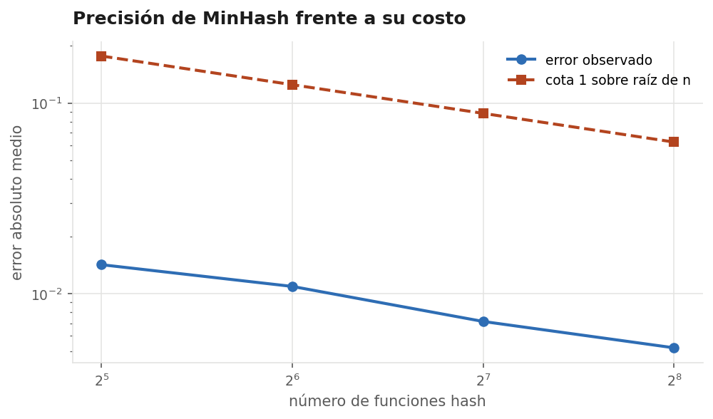

Archivo: figs/f18_error_minhash.svg y figs/f18_error_minhash.png

**Qué muestra.** El error observado sigue la cota teórica y baja como uno sobre la raíz de n: cuadruplicar las funciones hash solo divide el error entre dos. Pasar de 32 a 256 hashes baja el error de 0.0142 a 0.0052, a cambio de multiplicar por ocho la memoria de la firma. Se eligen 128 hashes: el error de 0.0072 es muy inferior al ancho de las bandas de decisión de LSH, así que gastar más no compra nada.

**Cómo explicarla.** El error observado sigue la cota teórica y baja como uno sobre la raíz de n. Eso tiene una consecuencia práctica dura: cuadruplicar las funciones hash solo divide el error entre dos. Pasar de treinta y dos a doscientos cincuenta y seis baja el error de 0,0142 a 0,0052 multiplicando por ocho la memoria.

**Si preguntan.** ¿Por qué se quedaron en 128 funciones hash?

**Qué responder.** Porque el error con 128 es 0,0072 y el ancho de la banda de decisión de LSH es un orden de magnitud mayor. Gastar más memoria afinaría una estimación por debajo de la resolución con la que luego se decide, así que no compra nada. Es el mismo razonamiento que no medir en milímetros lo que se va a cortar con sierra.

### Figura 19. Curva S de LSH según bandas y filas

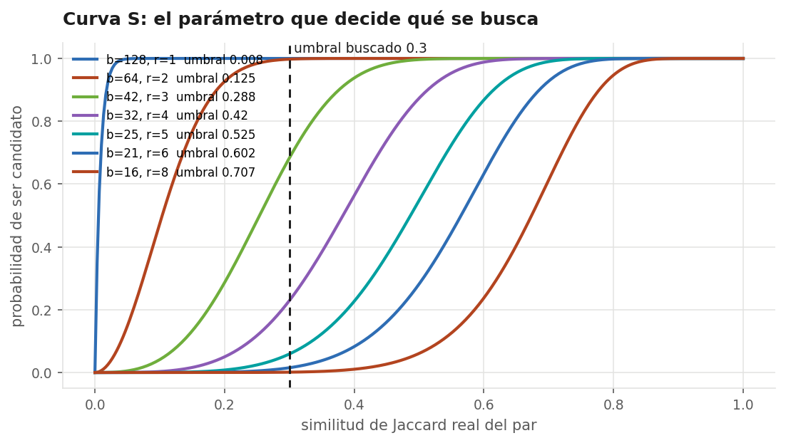

Archivo: figs/f19_curva_s.svg y figs/f19_curva_s.png

**Qué muestra.** Cada configuración es una decisión sobre qué cuenta como parecido, y la curva la hace explícita. Con muchas bandas y pocas filas sube temprano: atrapa todo lo parecido y también mucha basura. Con pocas bandas y muchas filas sube tarde: casi no hay falsos positivos pero se escapan pares legítimos. El umbral teórico (1/b) elevado a 1/r marca dónde la curva cambia de concavidad, y conviene no confundirlo con el punto medio: ahí la probabilidad no es un medio sino alrededor de 0,63, que es 1 menos 1 sobre e.

**Cómo explicarla.** La curva S hace explicito lo que normalmente queda implícito: elegir bandas y filas es decidir que cuenta como parecido. Muchas bandas y pocas filas atrapan todo lo parecido y mucha basura; pocas bandas y muchas filas casi no traen basura y dejan escapar pares legítimos.

**Si preguntan.** ¿El umbral teórico es donde la probabilidad vale un medio?

**Qué responder.** No, y es un error frecuente. La fórmula uno sobre b elevado a uno sobre r marca el punto de inflexión de la curva, donde cambia de concavidad. Ahí la probabilidad vale uno menos uno sobre e, unos 0,63. Lo verificamos numéricamente antes de escribirlo.

### Figura 20. Recall contra costo de verificación en el barrido de LSH

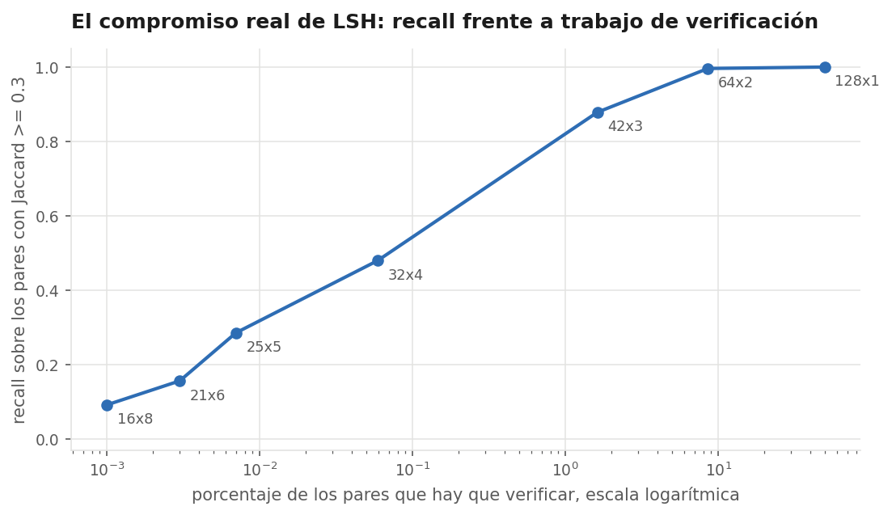

Archivo: figs/f20_recall_vs_costo.svg y figs/f20_recall_vs_costo.png

**Qué muestra.** Los dos errores no cuestan lo mismo y por eso la figura usa recall frente a costo. Un falso positivo lo elimina la verificación exacta posterior, de modo que es trabajo y no error; un falso negativo se pierde para siempre. La configuración b=64 por r=2 deja 1 falsos negativos de 263 pares verdaderos, con recall 0.996, y arrastra 170,997 falsos positivos, que es el 8.57 % de los pares a verificar. En el otro extremo, b=16 por r=8 baja los falsos positivos a 0 pero deja 239 falsos negativos, perdiendo la mayoría de lo que importa.

**Cómo explicarla.** Esta figura es la decisión de diseño de la parte. La métrica no es precisión ni F1, es recall contra costo, y la razón es que los dos errores no cuestan lo mismo: un falso positivo lo elimina la verificación exacta posterior, así que es trabajo; un falso negativo se pierde para siempre.

**Si preguntan.** ¿Por qué no usar F1, que es la métrica habitual?

**Qué responder.** Porque F1 trata los dos errores como equivalentes y aquí no lo son. Lo intentamos primero con F1 y seleccionaba una configuración con recall por debajo de la mitad, que para un generador de candidatos es inservible. LSH no es un clasificador, es un filtro barato delante de una verificación exacta, y se evalúa como tal.

### Figura 21. SimHash contra MinHash sobre los mismos pares

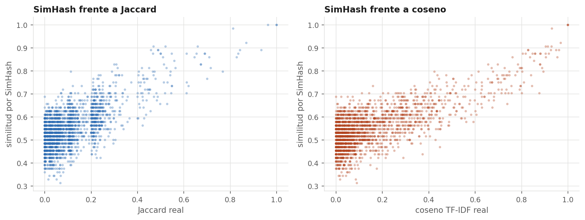

Archivo: figs/f21_simhash_vs_minhash.svg y figs/f21_simhash_vs_minhash.png

**Qué muestra.** Sobre pares que cubren todo el rango de similitud, SimHash correlaciona 0.734 con el coseno de TF-IDF y 0.694 con Jaccard. La diferencia es la esperada: cada esquema estima la métrica para la que fue diseñado. Conviene notar que ninguna correlación llega a uno, y el motivo es la resolución: con 64 bits la similitud estimada solo puede tomar 65 valores distintos, así que los puntos se alinean en bandas horizontales visibles en ambos paneles. Subir a 128 bits afinaría la escala a costa del doble de memoria por firma. La conclusión práctica no es elegir uno sino asignar cada uno a su tarea: MinHash sobre conjuntos sin peso, SimHash sobre vectores con peso.

**Cómo explicarla.** Cada esquema estima la métrica para la que fue diseñado y la figura lo confirma: SimHash correlaciona mejor con el coseno de TF-IDF y MinHash con Jaccard. La conclusión no es elegir uno sino asignar cada uno a su tarea.

**Si preguntan.** ¿Por qué ninguna correlación llega a uno?

**Qué responder.** Por resolución. Con sesenta y cuatro bits la similitud estimada solo puede tomar sesenta y cinco valores distintos, y eso produce las bandas horizontales visibles en los dos paneles. Subir a ciento veintiocho bits afinaría la escala a costa del doble de memoria por firma.

## Parte III. Búsqueda aproximada de vecinos

El hilo es cuándo un índice aproximado vale la pena. La respuesta honesta a nuestro volumen es que depende del régimen de uso, y la figura que lo demuestra es la que tiene dos paneles.

Notebook: [notebooks/3_ann_ivf_hnsw.ipynb](../notebooks/3_ann_ivf_hnsw.ipynb)

### Figura 22. Recall y latencia de IVF según nprobe

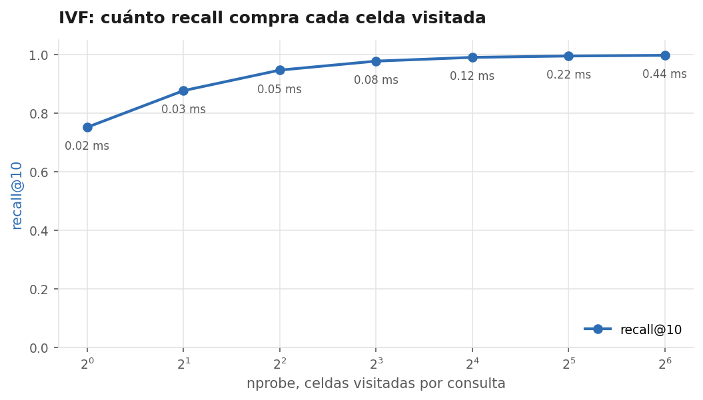

Archivo: figs/f22_ivf.svg y figs/f22_ivf.png

**Qué muestra.** El recall sube muy rápido al principio y luego se aplana, que es el comportamiento típico de IVF. Con nprobe=1 se visita el 0.35 % de las celdas y ya se recupera el 75 % de los vecinos verdaderos; con nprobe=16 se llega al 99 % a 0.122 ms por consulta. Pasar a nprobe=64 sube el recall a 100 % pero cuadruplica el trabajo. La curva dice dónde dejar de pagar: más allá de la rodilla cada punto de recall cuesta desproporcionadamente.

**Cómo explicarla.** IVF reparte los vectores en celdas y en consulta visita solo unas pocas. Con nprobe igual a uno visita el 0,35 por ciento de las celdas y ya recupera tres cuartos de los vecinos verdaderos; con dieciséis llega al 99 por ciento.

**Si preguntan.** ¿Dónde conviene dejar de subir nprobe?

**Qué responder.** En la rodilla de la curva. Pasar de dieciséis a sesenta y cuatro sube el recall un punto y cuadruplica el trabajo. La figura no da la respuesta sola: la da junto con lo que cueste un vecino perdido en la aplicación concreta.

### Figura 23. Recall y latencia de HNSW según efSearch

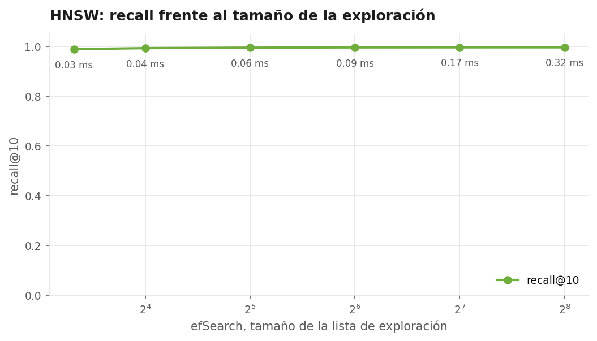

Archivo: figs/f23_hnsw.svg y figs/f23_hnsw.png

**Qué muestra.** HNSW llega alto con muy poca exploración: con efSearch=10 ya alcanza 99 % de recall en 0.028 ms, y con efSearch=256 llega a 100 %. La contrapartida está fuera de esta figura: construir el grafo tomó 7 s frente a 0 s de IVF, y el grafo guarda hasta 32 aristas por nodo además de los vectores. HNSW compra latencia con memoria y con tiempo de construcción.

**Cómo explicarla.** HNSW llega muy alto con exploración mínima: con efSearch igual a diez ya alcanza el 99 por ciento de recall. Lo importante está fuera de la figura y hay que decirlo: construir el grafo tomó siete segundos frente a cero de IVF, y el grafo guarda hasta treinta y dos aristas por nodo además de los vectores.

**Si preguntan.** ¿Entonces HNSW es mejor que IVF?

**Qué responder.** En latencia de consulta sí, con este volumen. Pero compra esa latencia con memoria y con tiempo de construcción, y con un índice que no admite inserciones masivas tan bien como IVF. Si la base cambia todo el tiempo o la memoria es escasa, IVF sigue siendo la elección.

### Figura 24. Lo aproximado contra lo exacto, en lote y consulta a consulta

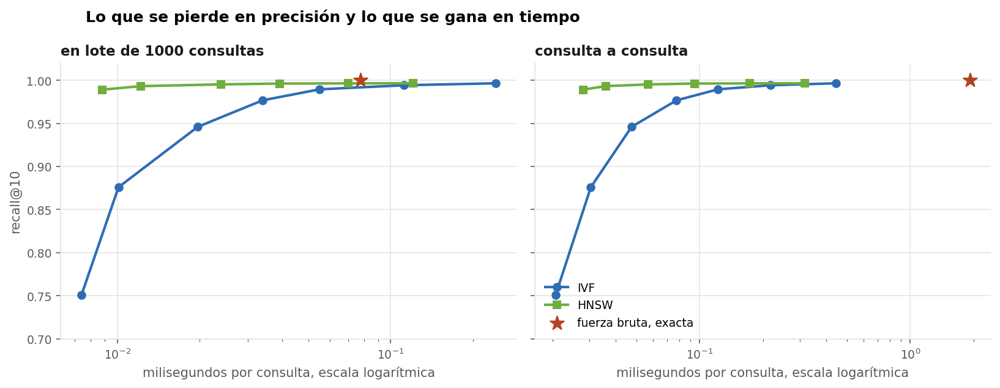

Archivo: figs/f24_ann_vs_exacta.svg y figs/f24_ann_vs_exacta.png

**Qué muestra.** Los dos paneles cuentan historias opuestas y por eso hacen falta los dos. En lote, la fuerza bruta tarda 0.0777 ms por consulta y el mejor HNSW sobre 95 % de recall tarda 0.0088 ms: el índice aproximado no aporta nada, porque el índice plano resuelve el lote como un producto de matrices con BLAS sobre ocho núcleos. Consulta a consulta la situación se invierte: la fuerza bruta tarda 1.924 ms y HNSW 0.028 ms, es decir 69.0 veces más rápido, e IVF 0.078 ms. La moraleja es que la pregunta de si un índice aproximado vale la pena no tiene respuesta sin decir antes si el uso es por lotes o en línea.

**Cómo explicarla.** Esta es la figura de la que estoy más satisfecho porque corrige un error que nosotros mismos cometimos. Los dos paneles cuentan historias opuestas. En lote el índice aproximado no aporta nada, porque el índice plano resuelve el lote como un producto de matrices con BLAS sobre ocho núcleos. Consulta a consulta se invierte, y HNSW es unas setenta veces más rápido.

**Si preguntan.** ¿Cuál de los dos números es el correcto?

**Qué responder.** Los dos, para preguntas distintas. El error está en comparar un lado medido en lote contra el otro medido consulta a consulta, que es lo que nos dio un falso veintiocho por multiplicador la primera vez. Toda latencia se mide en el mismo régimen en ambos lados, y la consulta única con un solo hilo de OpenMP para que no dependa de la carga de la máquina.

### Figura 25. Escalado del tiempo con el tamaño de la base

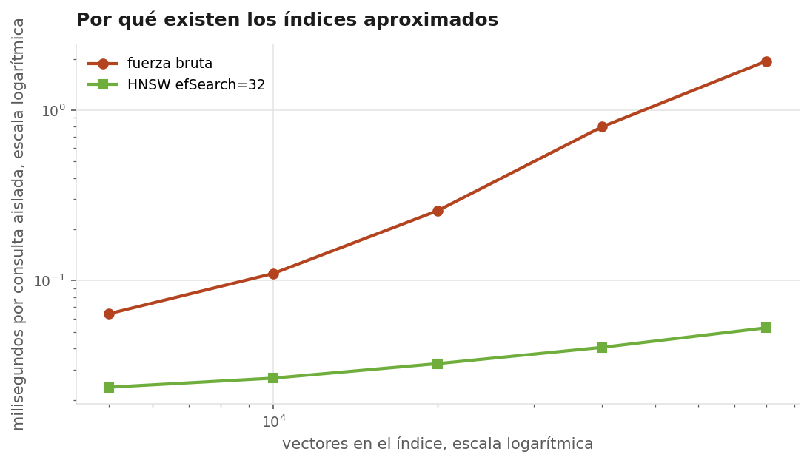

Archivo: figs/f26_escalado.svg y figs/f26_escalado.png

**Qué muestra.** Las dos rectas tienen pendientes distintas y esa diferencia es todo el argumento. Multiplicar la base por 16 multiplica el tiempo de la fuerza bruta por 30.3, que es crecimiento lineal, y el de HNSW por solo 2.2. La ventaja pasa de 2.7 veces con 5,000 vectores a 36.7 veces con 80,000. La conclusión práctica para este proyecto es incómoda y hay que decirla: a nuestro volumen y en uso por lotes el índice aproximado no era necesario. Lo que lo justifica es el uso en línea y el escenario de volumen diez o cien veces mayor que plantea la Parte VI, y eso está medido aquí en lugar de supuesto.

**Cómo explicarla.** Las dos rectas tienen pendientes distintas y esa diferencia es todo el argumento. Multiplicar la base por dieciséis multiplica el tiempo de la fuerza bruta por treinta, que es lineal, y el de HNSW por dos. La ventaja pasa de tres veces a casi cuarenta.

**Si preguntan.** ¿Entonces para este proyecto el índice aproximado era necesario?

**Qué responder.** A nuestro volumen y en uso por lotes, no, y preferimos decirlo. Lo que lo justifica es el uso en línea y el escenario de volumen diez o cien veces mayor que plantea la Parte VI. La diferencia es que eso está medido aquí en lugar de supuesto.

### Figura 26. Dos representaciones del mismo texto, mismo índice exacto

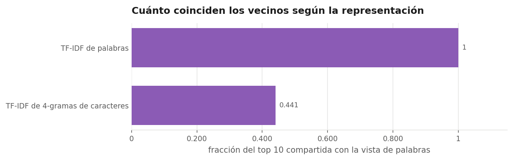

Archivo: figs/f25_representaciones.svg y figs/f25_representaciones.png

**Qué muestra.** Con el índice fijo y exacto en ambos casos, las dos representaciones comparten solo el 44 % de los diez vecinos. Es un recordatorio incómodo: una parte grande de lo que se llama error de un índice aproximado es en realidad una decisión de representación tomada mucho antes. Los n-gramas de caracteres agrupan por forma de escritura y toleran errores de digitación; las palabras agrupan por vocabulario compartido. Ninguna es la correcta en abstracto.

**Cómo explicarla.** Con el índice fijo y exacto en los dos casos, las dos representaciones comparten solo el 44 por ciento de los diez vecinos. Es un recordatorio incómodo: buena parte de lo que se llama error de un índice aproximado es en realidad una decisión de representación tomada mucho antes.

**Si preguntan.** ¿Cuál representación es la correcta?

**Qué responder.** Ninguna en abstracto. Los n-gramas de caracteres agrupan por forma de escritura y toleran errores de digitación, que abundan en nombres de entidades. Las palabras agrupan por vocabulario compartido. La elección depende de si el parecido que se busca es ortográfico o semántico.

## Parte IV. Muestreo, Bloom, Count-Min y DGIM

El hilo es que en un flujo no se puede guardar todo, y cada estructura renuncia a algo distinto. Lo que se defiende no es que ahorren memoria, sino que el error que introducen está acotado y es el aceptable para la pregunta que responden.

Notebook: [notebooks/4_flujos.ipynb](../notebooks/4_flujos.ipynb)

### Figura 27. Tres estrategias de muestreo sobre el mismo flujo

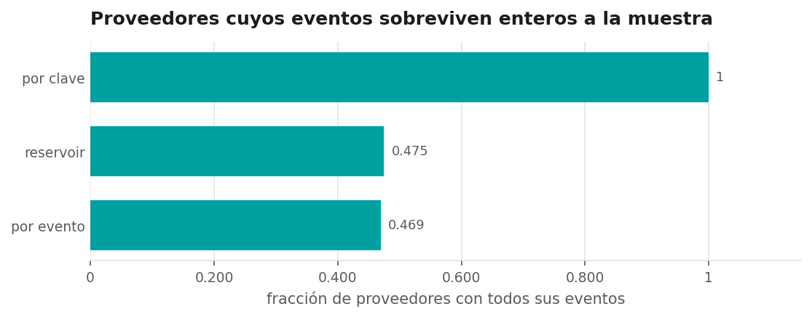

Archivo: figs/f27_muestreo.svg y figs/f27_muestreo.png

**Qué muestra.** Los tres conservan aproximadamente el mismo número de eventos, así que por tamaño son equivalentes. Por utilidad no lo son en absoluto. Con muestreo por evento solo el 46.9 % de los proveedores queda completo, de modo que cualquier pregunta del tipo cuántas adjudicaciones acumuló este proveedor da una respuesta falsa sobre la muestra. Con muestreo por clave el 100 % queda completo, porque la entidad entra entera o no entra. El reservoir se comporta como el muestreo por evento, que es lo esperado: su garantía es de uniformidad sobre eventos, no de integridad por entidad.

**Cómo explicarla.** Los tres métodos conservan aproximadamente el mismo número de eventos, así que por tamaño son equivalentes. Por utilidad no lo son en absoluto: con muestreo por evento solo la mitad de los proveedores queda completo, y con muestreo por clave queda completo el cien por ciento.

**Si preguntan.** ¿Por qué importa que una entidad quede completa?

**Qué responder.** Porque cambia qué preguntas admite la muestra. Sobre muestreo por evento la pregunta cuántas adjudicaciones acumuló este proveedor da una respuesta falsa, no imprecisa: le faltan filas. El muestreo por clave resuelve eso a cambio de perder uniformidad sobre eventos, y por eso el reservoir sigue haciendo falta para estimar proporciones.

### Figura 28. El reservoir reproduce la composición del flujo

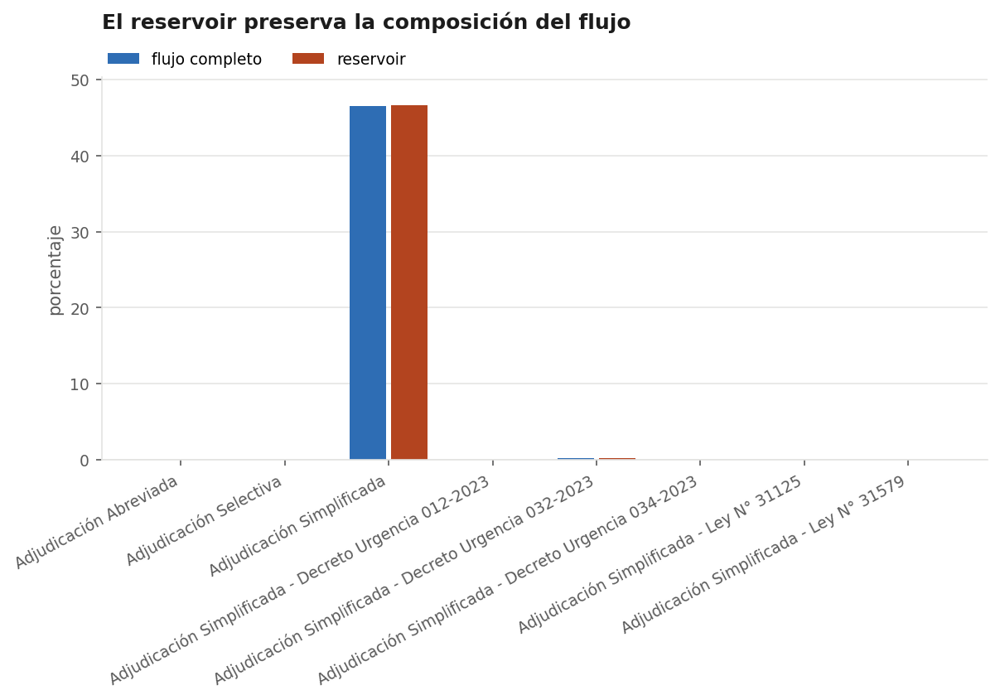

Archivo: figs/f28_reservoir.svg y figs/f28_reservoir.png

**Qué muestra.** Verificación empírica de la garantía teórica. El invariante del reservoir es que, tras ver i elementos, cada uno está en la muestra con probabilidad k sobre i, y eso implica que la composición de la muestra debe reproducir la del flujo. La desviación máxima entre ambas distribuciones es de 0.06 puntos porcentuales sobre los ocho métodos más frecuentes, lo que confirma que la muestra es utilizable para estimar proporciones aunque no sirva para preguntas por entidad.

**Cómo explicarla.** Esta figura es una verificación, no un hallazgo. El invariante del reservoir es que tras ver i elementos cada uno está en la muestra con probabilidad k sobre i, y eso implica que la composición de la muestra debe reproducir la del flujo. La desviación máxima observada es de seis centésimas de punto porcentual.

**Si preguntan.** ¿Para qué sirve verificar algo que ya está demostrado?

**Qué responder.** Para distinguir un error de teoría de un error de implementación. La demostración garantiza el algoritmo, no nuestro código. Esta figura es la que detecta si el índice aleatorio está mal calculado, que es el fallo típico al escribir reservoir.

### Figura 29. Tasa de falsos positivos del filtro de Bloom

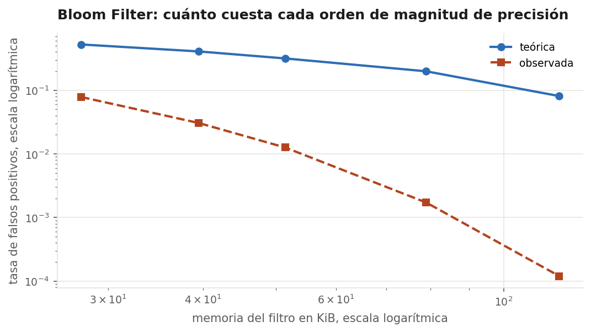

Archivo: figs/f29_bloom.svg y figs/f29_bloom.png

**Qué muestra.** La curva observada sigue a la teórica, lo que valida la implementación. Lo que decide es la comparación con la alternativa exacta: guardar los 67,510 identificadores en un conjunto de Python costaría del orden de 1,582 KiB, mientras que el filtro con 1 % de falsos positivos ocupa 79.0 KiB, unas 20 veces menos. Los falsos negativos observados son 0 en todas las configuraciones, como garantiza la construcción. Bajar de 1 % a 0,1 % cuesta un 50 % más de memoria, así que el punto razonable depende de qué se haga con un falso positivo.

**Cómo explicarla.** La curva observada sigue a la teórica, lo que valida la implementación. Lo que decide es la comparación con la alternativa exacta: el conjunto de Python con los sesenta y siete mil identificadores costaría del orden de mil quinientos kibibytes y el filtro con uno por ciento de error ocupa setenta y nueve. Y los falsos negativos son cero en todas las configuraciones.

**Si preguntan.** ¿Por qué no hay falsos negativos?

**Qué responder.** Por construcción, no por suerte. Insertar solo pone bits en uno y nunca los apaga, así que si un elemento se insertó, sus k posiciones están encendidas y la consulta no puede responder que no está. Esa asimetría es lo que hace al Bloom útil como primer filtro: un no es definitivo.

### Figura 30. Error del Count-Min Sketch según ancho y profundidad

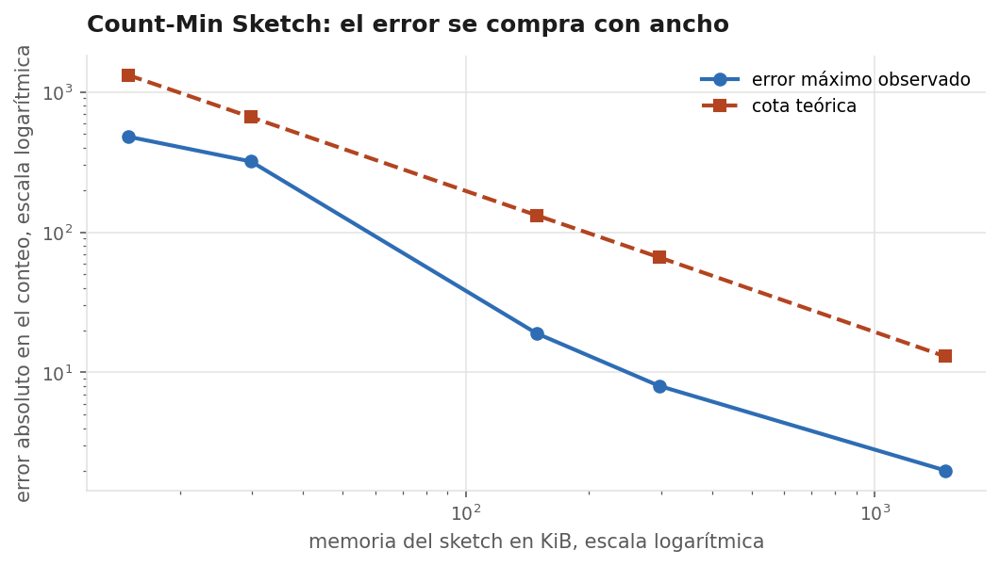

Archivo: figs/f30_cms.svg y figs/f30_cms.png

**Qué muestra.** El error observado queda siempre por debajo de la cota teórica, y nunca hay subestimaciones (0 en total), que es exactamente lo que garantiza tomar el mínimo de las filas. El ancho controla el error y la profundidad la probabilidad de excederlo. Pasar de 15 KiB a 1,487 KiB baja el error máximo de 480.0 a 2.0 apariciones. Para comparar: el diccionario exacto de 4,664 códigos ocupa del orden de 273 KiB, así que aquí el sketch solo compensa si el universo de claves fuera mucho mayor, y eso hay que decirlo.

**Cómo explicarla.** El error observado queda siempre por debajo de la cota teórica y nunca hay subestimaciones, que es exactamente lo que garantiza tomar el mínimo de las filas. El ancho controla el error y la profundidad la probabilidad de excederlo.

**Si preguntan.** ¿En este caso el sketch realmente ahorró memoria?

**Qué responder.** No, y lo reportamos así. El diccionario exacto de cuatro mil seiscientos códigos ocupa del orden de doscientos setenta kibibytes, y para bajar el error a dos apariciones el sketch necesita mil cuatrocientos. El Count-Min compensa cuando el universo de claves es mucho mayor que la memoria disponible, y nuestro universo de códigos CUBSO no lo es. Lo incluimos porque el curso lo pide y porque medir cuándo una estructura no conviene también es resultado.

### Figura 31. Bloom contra Count-Min a igual tasa de error

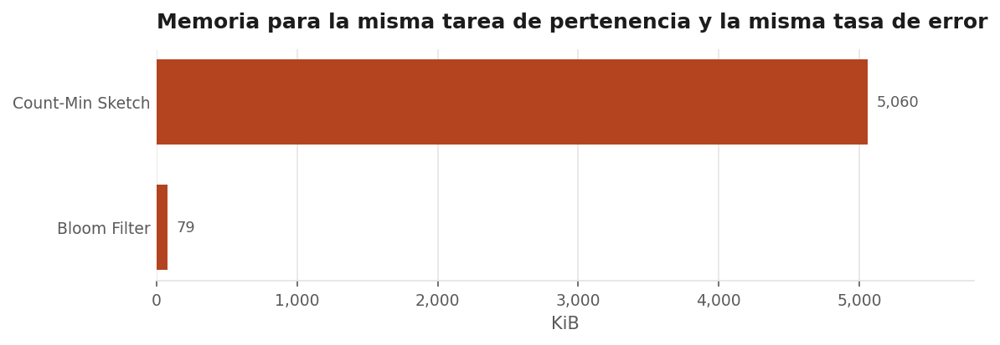

Archivo: figs/f31_bloom_vs_cms.svg y figs/f31_bloom_vs_cms.png

**Qué muestra.** El Count-Min se dimensionó resolviendo su propia fórmula de colisión para que alcance la misma tasa de falsos positivos que el Bloom, no eligiendo parámetros a ojo. Con tasas equivalentes (0.0017 frente a 0.0017), necesita 5,060 KiB contra 79.0 KiB, es decir 64 veces más, y la razón es estructural: guarda un contador de ocho bytes donde al otro le basta un bit. No se sustituyen. El Bloom es la estructura correcta cuando la pregunta es si algo apareció; el Count-Min cuando la pregunta es cuántas veces. Usar el segundo para lo primero es pagar sesenta y cuatro veces por la misma respuesta.

**Cómo explicarla.** Esta figura responde por qué usamos las dos estructuras y no una. Dimensionamos el Count-Min resolviendo su propia fórmula de colisión para que alcance la misma tasa de falsos positivos que el Bloom, no eligiendo parámetros a ojo. A igual error necesita sesenta y cuatro veces más memoria.

**Si preguntan.** ¿De dónde sale ese factor sesenta y cuatro?

**Qué responder.** De una diferencia estructural: el Count-Min guarda un contador de ocho bytes donde al Bloom le basta un bit. Las dos no se sustituyen, responden preguntas distintas. El Bloom contesta si algo apareció y el Count-Min cuántas veces. Usar el segundo para lo primero es pagar sesenta y cuatro veces por la misma respuesta. La primera versión de esta figura daba lo contrario porque habíamos dimensionado el Count-Min a ojo, y encontrarlo fue lo que nos obligó a derivar la fórmula.

### Figura 32. Error de DGIM sobre ventanas de distinto tamaño

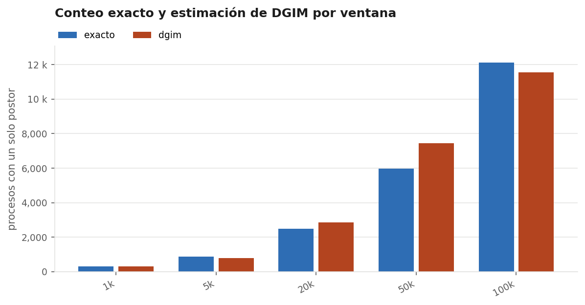

Archivo: figs/f32_dgim.svg y figs/f32_dgim.png

**Qué muestra.** Las barras quedan casi a la misma altura en todas las ventanas: el peor error relativo es 25.0 % con N=50,000, muy por debajo de la cota teórica del 50 % que garantiza usar dos cubos por tamaño. Lo que compra ese error es la memoria: para la ventana de 150,000 elementos, DGIM usa 20 cubos, del orden de 320 bytes, frente a 18,750 bytes de la ventana completa en bits. Es una reducción de 59 veces, y crece con N porque la memoria de DGIM depende del logaritmo de la ventana y no de la ventana.

**Cómo explicarla.** Las barras quedan casi a la misma altura en todas las ventanas, y el peor error relativo observado es del 25 por ciento, muy por debajo de la cota teórica del 50 por ciento que garantiza usar dos cubos por tamaño. Lo que compra ese error es memoria: en la ventana más grande DGIM usa veinte cubos frente a la ventana entera en bits.

**Si preguntan.** ¿Un error del 25 por ciento no es demasiado para ser útil?

**Qué responder.** Depende de la pregunta. Para decidir si una entidad está en una racha de actividad inusual, un conteo con error acotado llega antes y basta. Para una cifra que se publica, no sirve. Y la cota se ajusta: con r cubos por tamaño en lugar de dos el error baja a uno sobre r menos uno, a cambio de más memoria.

### Figura 33. Memoria de DGIM contra la ventana exacta

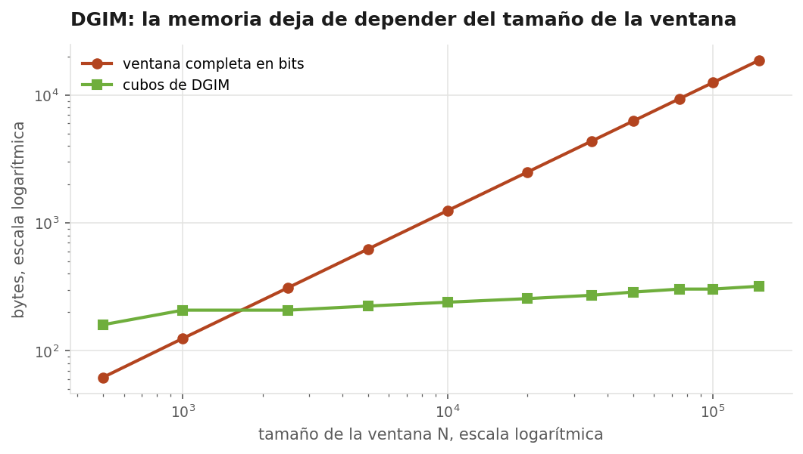

Archivo: figs/f33_dgim_memoria.svg y figs/f33_dgim_memoria.png

**Qué muestra.** Las dos rectas divergen y ese es el argumento entero. Multiplicar la ventana por 300 multiplica la memoria exacta por lo mismo, mientras que los cubos de DGIM pasan solo de 10 a 20, porque su número depende del logaritmo de N. Con ventanas pequeñas DGIM no compensa, incluso pierde; el cruce aparece alrededor de los primeros miles de elementos y a partir de ahí la distancia solo crece.

**Cómo explicarla.** Las dos rectas divergen y ese es el argumento entero. Multiplicar la ventana por trescientos multiplica la memoria exacta por lo mismo, y los cubos de DGIM pasan solo de diez a veinte, porque su número depende del logaritmo de N.

**Si preguntan.** ¿Entonces DGIM siempre conviene?

**Qué responder.** No. Con ventanas pequeñas pierde, porque cada cubo guarda una marca de tiempo y eso cuesta más que unos pocos bits. El cruce está alrededor de los primeros miles de elementos. Decir que una estructura sublineal siempre gana es el error que esta figura evita.

### Figura 34. Costo en tiempo de cada estructura

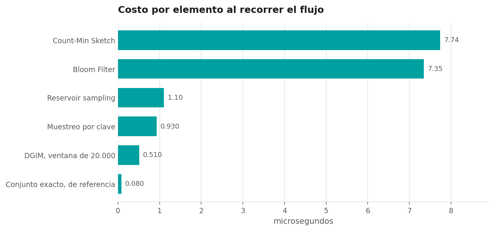

Archivo: figs/f38_tiempos_estructuras.svg y figs/f38_tiempos_estructuras.png

**Qué muestra.** El tiempo es la tercera dimensión del compromiso, junto a precisión y memoria, y conviene mirarla antes de celebrar el ahorro de memoria. El filtro de Bloom cuesta 7.35 microsegundos por elemento frente a 0.08 del conjunto exacto de Python, es decir 91.9 veces más, porque calcula varias funciones hash donde el conjunto nativo calcula una sola y está implementado en C. La conclusión honesta es que estas estructuras no ahorran tiempo: cambian memoria por tiempo y por un error acotado, y se eligen cuando la memoria es el recurso escaso.

**Cómo explicarla.** Añadimos esta figura porque el discurso habitual sobre estas estructuras habla solo de memoria y precisión, y falta la tercera dimensión. El filtro de Bloom cuesta unas noventa veces más tiempo por elemento que el conjunto exacto de Python, porque calcula varias funciones hash donde el conjunto nativo calcula una y está implementado en C.

**Si preguntan.** ¿Entonces estas estructuras no sirven?

**Qué responder.** Sirven cuando la memoria es el recurso escaso, que es la situación de un flujo que no cabe. La conclusión honesta es que no ahorran tiempo: cambian memoria por tiempo y por un error acotado. Presentarlas como una mejora en todos los ejes sería falso.

## Parte V. Reglas de asociación

El hilo es que la definición de transacción es la decisión más importante de toda la parte, más que el algoritmo. Con la definición equivocada los dos algoritmos devuelven lo mismo: nada.

Notebook: [notebooks/5_reglas_asociacion.ipynb](../notebooks/5_reglas_asociacion.ipynb)

### Figura 35. La canasta natural contra la canasta por entidad y mes

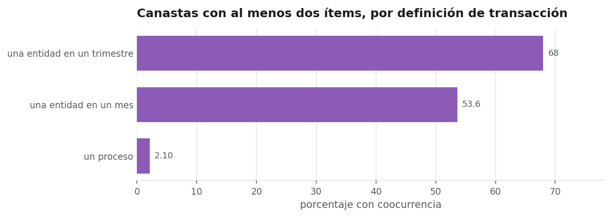

Archivo: figs/f34_definicion_transaccion.svg y figs/f34_definicion_transaccion.png

**Qué muestra.** Esta figura decide la parte entera, y da una respuesta incómoda: la definición natural no sirve. Solo el 2.1 % de los procesos tiene dos o más ítems, con un tamaño medio de canasta de 0.74. Un conjunto de un solo elemento no contiene coocurrencia, así que A-Priori y FP-Growth sobre esa definición devolverían únicamente conjuntos de tamaño uno, es decir un ranking de frecuencias disfrazado de minería de patrones. El motivo es que el catálogo CUBSO identifica el objeto del proceso y la mayoría de los procesos peruanos tienen un objeto único: la analogía del supermercado no se sostiene a nivel de acto administrativo. Agrupar por entidad y mes sube la coocurrencia al 53.6 % con tamaño medio 2.78, y es la definición que se adopta.

**Cómo explicarla.** Esta figura decide la parte entera y da una respuesta incómoda: la definición natural no sirve. Solo el 2 por ciento de los procesos tiene dos o más ítems, con tamaño medio de canasta por debajo de uno. Un conjunto de un elemento no contiene coocurrencia, así que A-Priori y FP-Growth sobre esa definición devolverían solo conjuntos de tamaño uno, es decir un ranking de frecuencias disfrazado de minería de patrones.

**Si preguntan.** ¿No es hacer trampa cambiar la definición hasta que salga algo?

**Qué responder.** Sería trampa si la definición nueva no tuviera sentido. La tiene: el catálogo CUBSO identifica el objeto del proceso y la mayoría de procesos peruanos tienen un objeto único, así que la analogía del supermercado no se sostiene a nivel de acto administrativo. Lo que sí se parece a una canasta es lo que una entidad compra en un mes, y eso sube la coocurrencia al 53,6 por ciento. La figura documenta las dos definiciones para que el lector juzgue el cambio, en lugar de presentar solo la que funcionó.

### Figura 36. A-Priori contra FP-Growth al bajar el soporte

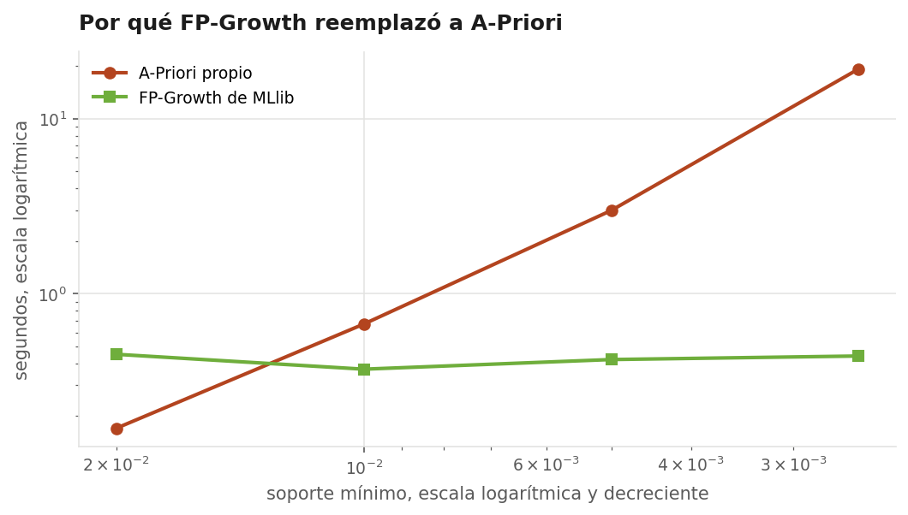

Archivo: figs/f35_apriori_vs_fpgrowth.svg y figs/f35_apriori_vs_fpgrowth.png

**Qué muestra.** Con soporte alto los dos cuestan parecido porque hay pocos conjuntos frecuentes y A-Priori poda casi todo en el primer nivel. Al bajar el umbral de 0.02 a 0.0025 el número de conjuntos pasa de 34 a 554 y A-Priori pasa de 0.17 s a 19.27 s, mientras que FP-Growth se mantiene en el entorno de 0.44 s. La diferencia es estructural: A-Priori genera y cuenta candidatos nivel por nivel, de modo que el número de candidatos explota cuando el umbral baja, y FP-Growth no genera candidatos en absoluto. Esa es exactamente la razón por la que el segundo desplazó al primero.

**Cómo explicarla.** Con soporte alto los dos cuestan parecido porque hay pocos conjuntos frecuentes y A-Priori poda casi todo en el primer nivel. Al bajar el umbral de 0,02 a 0,0025 A-Priori pasa de dos décimas de segundo a diecinueve, y FP-Growth se mantiene en el entorno de cuatro décimas.

**Si preguntan.** ¿Por qué implementar A-Priori si FP-Growth gana?

**Qué responder.** Porque A-Priori es donde se ve la propiedad que hace posible todo lo demás, la antimonotonicidad: si un conjunto no es frecuente, ningun superconjunto suyo lo es. Y porque la figura es el argumento: sin medir la explosión de candidatos, decir que FP-Growth es mejor sería repetir lo que dice el libro. La diferencia es estructural, A-Priori genera y cuenta candidatos nivel por nivel y FP-Growth no genera candidatos en absoluto.

### Figura 37. Soporte, confianza y lift de las reglas obtenidas

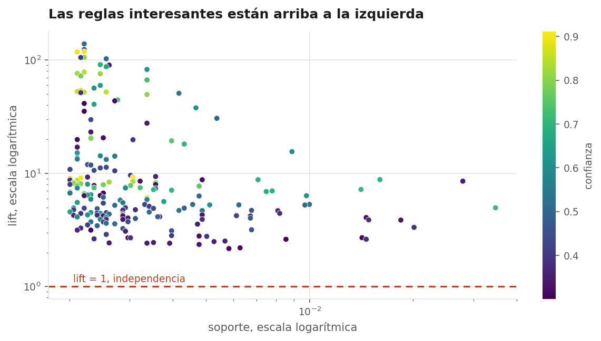

Archivo: figs/f36_reglas.svg y figs/f36_reglas.png

**Qué muestra.** La nube muestra el compromiso central de la minería de reglas. Las reglas de soporte alto tienen lift cercano a uno: describen ítems que coinciden por ser ambos frecuentes, no porque uno prediga al otro. Las de lift alto viven en la zona de soporte bajo, donde el patrón es fuerte pero afecta a pocas transacciones. El máximo de lift es 139, es decir que ese par aparece junto 139 veces más de lo que cabría esperar si fueran independientes. Filtrar solo por confianza traería las reglas inútiles del borde derecho; por eso el criterio de selección es lift alto con soporte suficiente para que la regla no sea una anécdota.

**Cómo explicarla.** Esta nube muestra el compromiso central de la minería de reglas. Las reglas de soporte alto tienen lift cercano a uno: describen ítems que coinciden por ser ambos frecuentes, no porque uno prediga al otro. Las de lift alto viven en la zona de soporte bajo, donde el patrón es fuerte y afecta a pocas transacciones.

**Si preguntan.** ¿Por qué no filtrar simplemente por confianza alta?

**Qué responder.** Porque la confianza no descuenta la frecuencia del consecuente. Una regla que concluye en un ítem presente en la mitad de las canastas tiene confianza alta por construcción y no informa nada. El lift sí lo descuenta, porque compara contra la independencia. El criterio es lift alto con soporte suficiente para que la regla no sea una anecdota.

### Figura 38. Dónde se concentran los procesos sin competencia

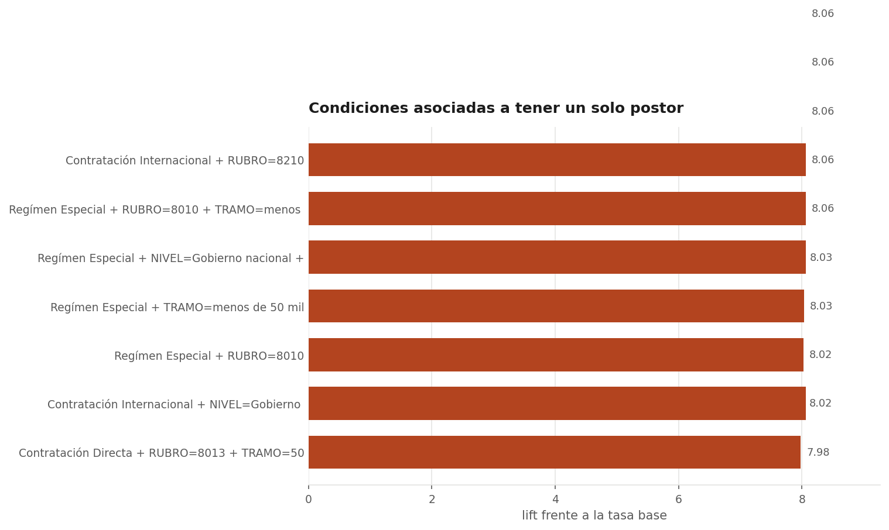

Archivo: figs/f37_postor_unico.svg y figs/f37_postor_unico.png

**Qué muestra.** Esta figura responde la pregunta que quedó abierta en la Parte I: el suelo de procesos sin competencia no se reparte al azar. La tasa base de postor único es 12.4 %, de modo que el lift máximo posible es 8.1 y lo alcanza toda condición con confianza igual a uno. Hay 5 combinaciones empatadas en ese máximo, así que el ranking por lift no distingue entre ellas y se desempata por soporte: la más extendida es [METODO=Regímen Especial + NIVEL=Gobierno nacional + TRAMO=menos de 50 ], presente en el 1.8 % de los procesos. Que un régimen especial o una contratación internacional tengan un solo postor es administrativamente esperable y no indica nada irregular; el valor de la figura es acotar dónde buscar, y lo informativo son las combinaciones donde el procedimiento sí preveía concurrencia.

**Cómo explicarla.** Esta figura responde la pregunta que quedó abierta en la Parte I. El suelo de procesos sin competencia no se reparte al azar entre tipos de compra, se concentra en grupos identificables.

**Si preguntan.** ¿Eso es evidencia de direccionamiento?

**Qué responder.** No, y aquí la prudencia es parte del resultado. Parte de lo que aparece arriba es administrativamente esperable: servicios con un único proveedor habilitado, bienes de marca única, contrataciones por emergencia. Lo que entrega el análisis es una lista priorizada de dónde mirar, no una conclusión sobre conducta. Afirmar lo segundo con estos datos sería incorrecto.

## Las tres preguntas que más probablemente harán

**¿Qué parte del trabajo no funcionó como esperaban?** Tres. El tamaño del shingle no tiene óptimo que salga de los datos, y lo decimos en lugar de inventar una métrica que lo produjera. La canasta natural del proceso no es minable, con lo que hubo que redefinir la transacción. Y el índice aproximado de vecinos no era necesario a nuestro volumen en uso por lotes, cosa que medimos antes de afirmar lo contrario.

**¿Qué error cometieron y cómo lo encontraron?** El más instructivo fue medir la búsqueda exacta en lotes de mil consultas y la aproximada consulta a consulta, lo que daba un falso multiplicador de veintiocho. Lo encontramos al no poder explicar por qué el índice plano escalaba mejor de lo que dice la teoría. La corrección fue medir los dos lados en el mismo régimen y reportar los dos regímenes.

**¿Cómo sabemos que las implementaciones propias son correctas?** Cada una se verifica contra su definición antes de usarse, y donde existe equivalente se contrasta con Spark MLlib o con FAISS. La implementación propia demuestra que se entiende el mecanismo; el contraste demuestra que no se entendió mal. Las dos cosas están en los notebooks, no solo afirmadas aquí.
